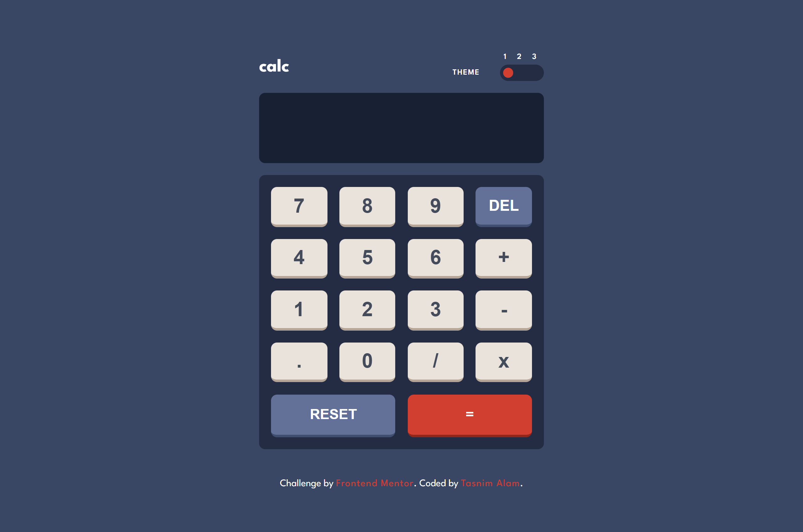
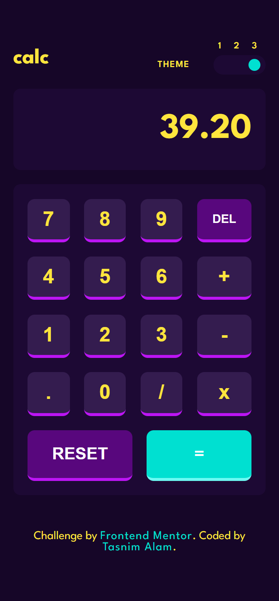

# Frontend Mentor - Calculator app solution


This is a solution to the [Calculator app challenge on Frontend Mentor](https://www.frontendmentor.io/challenges/calculator-app-9lteq5N29). Frontend Mentor challenges help you improve your coding skills by building realistic projects. 

## Table of contents

- [Overview](#overview)
  - [The challenge](#the-challenge)
  - [Screenshot](#screenshot)
  - [Links](#links)
- [My process](#my-process)
  - [Built with](#built-with)
  - [What I learned](#what-i-learned)
  - [Continued development](#continued-development)
- [Author](#author)

## Overview

### The challenge

Users should be able to:

- See the size of the elements adjust based on their device's screen size
- Perform mathmatical operations like addition, subtraction, multiplication, and division
- Adjust the color theme based on their preference
- **Bonus**: Have their initial theme preference checked using `prefers-color-scheme` and have any additional changes saved in the browser

### Screenshot





### Links

- Solution URL: [Repository]()
- Live Site URL: [Live Preview]()

## My process

### Built with

- Semantic HTML5 markup
- CSS custom properties
- Flexbox
- CSS Grid

### What I learned

3 State Toggle to change the color theme

```html

          <div class="toggle-container" id="toggleContainer">
            <button class="toggle-state" id="state1"></button>
            <button class="toggle-state" id="state2"></button>
            <button class="toggle-state" id="state3"></button>
            <div class="circle"></div>
          </div>
```
```css
#toggleContainer {
  position: relative;
  background: var(--toggle-and-keypad-background);
  width: 4.4rem;
  height: 1.6rem;
  padding: 0.3rem 0.4rem;
  border-radius: 1.2rem;
  display: flex;
  justify-content: space-around;
  align-items: center;
}

.toggle-state{
  padding: 0.4rem;
  border: none;
  opacity: 0;
  cursor: pointer;
}

.circle {
  position: absolute;
  background: var(--equal-key-background);
  width: 1rem;
  height: 1rem;
  border-radius: 50%;
  transition: left 300ms ease-in;
  left: 7%;
  cursor: pointer;
}
```
```js
const toggleStates = document.querySelectorAll('.toggle-state')
const circle = document.querySelector('.circle')
console.log()


toggleStates.forEach((button) => {
    button.addEventListener('click', (event) => {
        const clickedButton = event.target;
        const clickedIndex = Array.from(toggleStates).indexOf(clickedButton);

        function formula() {
            return Math.ceil(((100 / toggleStates.length) * (clickedIndex)))
        }

        if (clickedIndex === 0) {
            circle.style.left = '0%'
            circle.style.marginLeft = '0.3rem'
            circle.style.marginRight = '0'
            document.body.className = ''
        } else if (clickedIndex === (toggleStates.length - 1)) {
            circle.style.left = `${formula()}%`
            circle.style.marginLeft = '0'
            circle.style.marginRight = '0'
            document.body.className = 'theme3'
        } else {
            circle.style.left = `${formula()}%`
            circle.style.marginInline = '0'
            document.body.className = 'theme2'
        }
    })
})
```

### Continued development
I have used 'eval()' function to do the calculation. I'm aware of the security risks it imposes. But I used it since it is a pretty straight-forward approach. However, I will soon update the code for a safer and more maintainable approach. Inshallah.

```js
function solveFunction() {
    const formattedNumber = eval(keypad.textContent)
    if (Number(formattedNumber) % 1 === 0) {
        return keypad.textContent = formattedNumber
    } else {
        // Decimal Number
        return keypad.textContent = formattedNumber.toFixed(2)
    }
}
```

## Author
- Website - [Tasnim Alam](https://github.com/Tasnim005)
- Frontend Mentor - [Tasnim005](https://www.frontendmentor.io/profile/Tasnim005)
